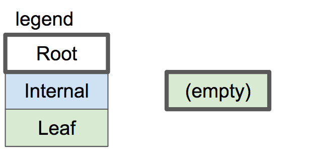

B-Tree是 SQLite 用来表示表和索引的数据结构，因此它是一个非常核心的思想。本文只是介绍数据结构，所以不会有任何代码。

为什么树是数据库的良好数据结构？

- 搜索特定值很快（对数时间）
- 插入/删除您已经找到的值速度很快（重新平衡的时间很长）
- 遍历一系列值的速度很快（与哈希映射不同）

B 树与二叉树不同（“B”可能代表发明者的名字，但也可以代表“平衡”）。这是一个 B 树示例：

与二叉树不同，B 树中的每个节点可以有 2 个以上的子节点。每个节点最多可以有 m 个子节点，其中 m 称为树的“order”。为了保持树基本平衡，我们还说节点必须至少有 m/2 个子节点（向上舍入）。

例外情况：

- 叶节点有 0 个子节点

- 根节点可以有少于 m 个子节点，但必须至少有 2 个
- 如果根节点是叶节点（唯一的节点），它仍然有 0 个子节点

上图是一个B-Tree，SQLite用它来存储索引。为了存储表，SQLites 使用一种称为 B+ 树的变体。

|                      | B-tree     | B+ tree         |
| :------------------- | :--------- | --------------- |
| 发音                 | “Bee Tree” | “Bee Plus Tree” |
| 用于存储             | 索引       | 表格            |
| 内部节点存储密钥     | Yes        | Yes             |
| 内部节点存储值       | Yes        | No              |
| 每个节点的子节点数量 | 较少       | 更多            |
| 内部节点与叶节点     | 结构相同   | 结构不同        |

在开始实现索引之前，将只讨论 B+ 树，但将其称为B-tree or a btree。

具有子节点的节点称为“内部”节点。内部节点和叶节点的结构不同：

| **m 阶树.**                 | 内部节点                    | 叶节点                               |
| :-------------------------- | :-------------------------- | :----------------------------------- |
| 存储                        | 指向子项的键和指针          | 键和值                               |
| Number of keys 按键数量     | up to m-1 最多 m-1          | as many as will fit 能装多少就装多少 |
| Number of pointers 指针数量 | number of keys + 1 键数 + 1 | none 没有任何                        |
| Number of values 值的数量   | none 没有任何               | number of keys 钥匙数量              |
| Key purpose 主要目的        | used for routing 用于路由   | paired with value 与价值配对         |
| Stores values? 储存价值？   | No                          | Yes                                  |

让我们通过一个示例来了解 B 树在向其中插入元素时如何增长。为了简单起见，树的order为 3。这意味着：

- 每个内部节点最多 3 个子节点
- 每个内部节点最多 2 个keys
- 每个内部节点至少有 2 个子节点
- 每个内部节点至少有 1 个key

空的B 树只有一个节点：根节点。根节点从具有零个键/值对的叶节点开始：

