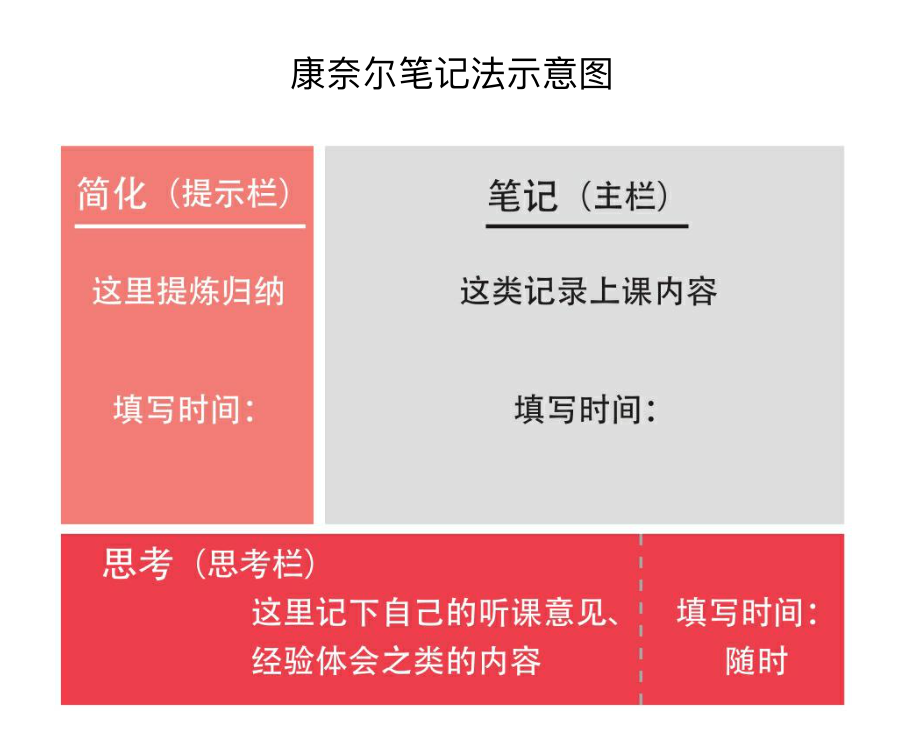

### 第1课 高效记忆，更快更牢掌握知识点

“如何提高记忆力、又快又好地把东西记牢记熟”是困扰不少同学的老大难问题。面对必须背诵的古诗词、历史事件，或者数理公式，很多人要么怎么都记不住，要么记完了之后又忘得特别快。

有些同学在考前临时抱佛脚，抓耳挠腮地抱着书死记硬背，到了考场发现题目似曾相识，答案却怎么也想不起来。有些同学背单词，完全就是举起书一个一个机械地往下背，背到一个词就重复读几遍，比如“apple，apple，苹果，苹果，apple，苹果”，然后就觉得大功告成了。结果过一会儿再回看，发现基本都忘光了。因为一而再、再而三地记不住，不少同学会进入自我否定的恶性循环，最后甚至放弃了。

事实上，我们绝大多数人并非天才，做不到过目不忘、“秒记”是很正常的。很多同学记不住东西绝非因为智商低，而是因为没有掌握提高记忆效率的方法，或者说，总是一个猛子扎进去死记硬背，压根儿没有思考过应该怎么去记东西，效果当然非常差。

记东西虽然着实令人头大，但如果掌握了好方法，就能事半功倍。一旦把知识点记牢了，你的考试分数和排名一定会有明显提升。即便只是背熟一个知识点，你在某次考试中也可能多得3分、5分。这看上去微不足道的几分，或许会对你的升学乃至命运产生关键性的影响。所以，无论如何都别因为畏难而轻易放弃。

从小学一年级到哈佛硕士毕业，我记了将近二十年的海量知识点。背东西有意思吗？实话实说，当然不好玩。但面对枯燥甚至有时让人崩溃的记忆任务，我总会提醒自己：咬牙顶住，决不退缩。此时心志和筋骨上的疲累，终将转化成升学目标实现那一刻的无上喜悦。

同时，我还总结了能让记东西不那么“难熬”的三大关键：

第一个关键，是要努力把记忆过程趣味化，加入一些生动和有趣的元素，只用眼看、用嘴念是非常枯燥的记忆形式。

第二个关键，是把表面看上去散乱无规律的东西努力地串联起来，变个体为整体，做有规律的整块记忆。

第三个关键，尽量借助自己已经熟悉、知道的内容去记忆新知识点，以旧带新。

下面，我将基于这“三个关键”，逐一讲解我自己最习惯使用的五大记忆法。

#### 第1小课　多感官刺激记忆法

多感官刺激记忆法，就是同时动用我们的多种感官，比如视觉、听觉和嗅觉等，来进行记忆。

也许你会问，记东西为什么还要用到听觉甚至嗅觉呢？和这些感官有什么关系呢？其实，当多种感官齐发时，大脑受刺激的效果会显著增强，记忆中枢能获得更充分的调动。

作个“简单粗暴”的类比：某个夏日午后，你热得汗流浃背。如果这时让你喝一杯冰可乐，你肯定会觉得解渴，但可能还是觉得热。而如果让你一边喝冰可乐，一边在凉爽的空调房里坐着，你一定会感到更加舒爽，解暑也更加彻底，因为这时你的皮肤（触觉）、味蕾（味觉）同时在感受凉爽。

同理，回到记忆这件事上，以背单词为例：如果你只是用眼睛盯着新单词记忆，相当于只刺激了视觉区域，无法对大脑形成足够刺激，达不到很好的记忆效果。在背单词时，一定要动用自己的听觉。具体做法有两个：一是在碎片时间里戴上耳机，听单词音频；二是尽量抽时间做单词听写练习。比如，你现在要背四六级单词，那么请一定选择配有音频的单词书（或其他背单词材料），每天确保至少听三次音频，并且我建议你把这三次拆分成“1+2次”。

##### “1+2次”记忆法

“1+2次”中的“1”，指的是在背诵新词当天就要同步听录音。在开始背诵新词前，至少先完整地听一遍新词音频，听的同时浏览对应的新词，建立对这些词最初的印象。背诵到具体某个词时，如果时间允许，可以再听一遍与其对应的录音。把当天所有新词都背完后，再完整地放一遍音频，一个词一个词地听下去，听的时候尽量不看书，逼自己快速拼读出单词。如果某个单词卡壳了，就重听一遍那个单词的音频，再次尝试记忆，直到熟练为止。

“1+2次”中的“2”，指的是一天结束前至少再利用两段碎片时间，听两遍当天的任务单词音频。比如，你可以在中午吃饭时听一遍，在晚上睡前再听一遍。听的时候仍然要逼自己同步拼读单词，遇到没记住的词就立即回到文本再背一遍，直到记牢为止。

##### 听写练习记忆法

另一个记忆的好方法，是做听写练习。如果时间有限，你可以把听写和纯听单词音频结合在一起，听的时候就准备好小本子，同步听写。如果时间充分，还可以每天抽出15—20分钟时间专门做一次听写练习，遇到拼不出来的词就快速地回到书本进行二次记忆和复习。

和背单词类似，古诗词记忆也可以使用多感官刺激记忆法。比如，背诵苏轼的《念奴娇·赤壁怀古》时，我们就可以把周杰伦谱曲演唱的《念奴娇》这首歌下载下来听：“大江东去，浪淘尽，千古风流人物。故垒西边，人道是，三国周郎赤壁。”边听歌，边体会，确实能记得更清楚、牢固。

我还记得自己在中学背诵苏轼的《水调歌头》和李煜的《相见欢》时，就配合着听了王菲和邓丽君演唱的以这两首诗词为蓝本创作的歌——《明月几时有》以及《独上西楼》。和诗以歌，将古诗词配以现代流行音乐，同时刺激视觉与听觉，记起来就快了不少。

除了听觉，我们还可以调动嗅觉和味觉。比如，背“chocolate”（巧克力）这个单词时，也同时吃一小块巧克力，边嚼边记，当再次吃到巧克力的时候就更容易回忆起这个单词，或者在看到“chocolate”这个词时就想起了当时的味道。

说来有趣，在所有同水果相关的单词里，除了apple和banana这样的常见水果外，我记得最牢的当属“durian”（榴梿）这个词。为什么呢？我上小学三年级时，父亲有次到马来西亚出差，顺便带了当地的冰冻榴梿回家。我在品尝这种味道独特的水果时，妈妈在一旁笑着说：“知道榴梿的英语怎么说吗？durian，durian，durian……”

一边是“上了头”的又臭又香的榴梿滋味，一边是妈妈清亮的英语复读，从此我对durian印象深刻。

#### 第2小课　缩略词记忆法

我常用的第二个记忆方法叫“缩略词记忆法”，无论是记单词还是背诵大段的史、地、政，这个方法都特别实用。可能不少同学对缩略词记忆法耳熟，但几乎没用过，那么不妨在读完我下面的介绍后就尝试起来。

当我们需要记忆一个系列的知识点时，不要马上开始从头到尾、逐字不差地记忆完整内容，而是把这个知识系列拆分成若干个片段，或者说是<u>**“关键元素”**</u>，接着把这几个关键片段的元素组成一串缩略语。我们首先把缩略语记熟、记牢，再通过这串缩略语，**以点带面**地记好全部内容。之后，每当我们看到这串缩略语时，就能根据关键元素，逐一回忆出所有内容。

这么说可能有些抽象，那就举一个几乎我所有美国同学都耳熟能详的例子：北美洲有著名的五大湖，包括苏必利尔湖（Lake Superior）、密歇根湖（Lake Michigan）、休伦湖（Lake Huron）、安大略湖（Lake Ontario）以及伊利湖（Lake Erie）。这五个词乍一看没有任何关联和规律，但如果我们把它们的首字母抽出来再看呢？S、M、H、O、E——好像还是没看出什么门道。再把这些字母的顺序调换一下呢？是不是就变成了——H、O、M、E、S，也就是英文单词home（家）的复数形式homes？这时，我们就把五个单词变成了一串缩略语——homes，然后就可以想象在湖面有许多房屋（homes）。由此一来，记忆北美五大湖就变成了以HOMES这个缩略词为线索，再通过每个字母记下其相对应的湖泊名称。记忆过程瞬间简单了许多，记忆效果却更加牢固。

在哈佛商学院攻读MBA时，我每天都要研读大量商业案例，记忆和理解纷繁复杂的商业原理。所幸不少知识点都可以通过缩略词记忆法，被概括成简练的关键词串，记忆难度也相应降低。比如，营销学教授杰瑞·麦卡锡提出的“4P理论”，就是将产品推广时需要考量的四个关键因素总结成了四个以“P”开头的单词，包括people（人，核心用户群是谁）、place（地点，应该在哪些区域进行推广）、price（价格，产品应该如何定价才最吸引消费者）以及product（产品本身应该具备哪些属性特质才富有竞争力）。诸如“4P”理论的缩略词商业原理还有很多，我几乎每天在哈佛都会学到、用到。不得不说，通过缩略词法去记忆抽象繁复的知识点，真的非常有效。

另外，学过财务会计的同学可能对这个概念比较熟悉——在计算物资存货成本时可以用到的几种方法包括先进先出法、加权平均法、移动加权平均法、个别计价法以及后进先出法。虽然逐个背诵并非不行，但记起来比较费力，还容易遗忘。如果我们把这五个名词的第一个字择出来，组成一个缩略词串——“先加移个后”，然后再去相应记忆呢？是不是就更容易了？以后每次需要复述这五种方法时，都可以从“先加移个后”开始，就会顺利得多。

你也开始试试吧。

#### 第3小课　联想记忆法

我要讲解的第三个记忆方法叫“联想记忆法”，和缩略词记忆法一样，也是很多人听过却没真正用过的一种方法。联想记忆法主要包含以下几种最重要的分类和用法。

##### 接近联想

“接近联想”，就是利用相互接近的事物进行联想和记忆。在记忆一个知识点的时候，自然联想起和它有相同或类似属性的另一个相近知识点。这样一来，我们就将片面知识的单个记忆变成了多个知识的立体记忆，从而显著提高记忆范围与效率。

知乎平台的记忆力大V馨月老师就分享过“用接近联想记忆法记历史事件”，我后来也在参考使用。举个例子，当你学习我国汉朝历史、了解大汉王朝的强盛时，就可以思考一下，同时期，世界其他地方是否存在和汉朝相当的强大国家呢？这时候，你就可以联想到罗马帝国。通过汉朝想到了罗马，它们都是伟大的王朝帝国，这就是重要的相近属性。从汉朝联想到罗马帝国还没完，我们还能继续延伸，想想这两个国家为什么在几乎同一时期变得如此强大？当时各自发展与崛起的背景是什么？两个国家都发生过哪些大事件？它们兴盛的共同因素是什么？等等。

从这个例子我们可以看出，接近联想不但可以跨时间和空间以点带面，还非常有助于知识面的拓宽，从整体记忆的过程中提炼出共同的基本特征与属性，从而加大学习的广度和深度。

##### 相似联想

“相似联想”和接近联想虽然听上去很像，却有本质的使用区别。相似联想，主要是通过联想一个看上去相近的具体图像，来记忆一个新知识点。

举个非常通俗的例子：当你记忆中国地图时，如果生硬地去记哪座山在中国的哪个区位、哪条河流经什么省，可能不太容易记住。但如果你把中国地图想象成一只雄鸡，鸡冠是什么位置，对应了什么省份，有哪些山川河流；鸡尾是什么省份，有哪些重要城市和名胜古迹，这样记忆起来就容易多了。类似地，你还可以把意大利的领土形状想象成一只靴子，把日本联想成一条蚕或一只海马，把伊朗的轮廓联想为一顶草帽……

所以，相似联想的精髓是把抽象陌生的新事物生动化、具象化，通过联想自己熟悉的形状、图像来达到降低记忆难度的目的。

##### 归类联想

第三种联想记忆方法叫“归类联想”，这个其实也不难理解。俗话说“物以类聚”，我们在记忆新事物的时候，可以把它和相同类别的东西捆绑起来，统一记忆。举几个很简单的例子：比如，你在吃牛油果的时候，可以想到，牛油果是一种原产于海外的热带水果，然后顺便联想记忆类似属性的热带水果，比如百香果、榴梿、山竹等。

又如，在我国文学史上，诗词家多如繁星，我们可以根据相近的风格或时代将他们归入特定流派，统一记忆。比方说，晋代的陶渊明、唐代的杜甫和白居易以及宋代的陆游就都可以被划进“现实主义流派”，而这一流派诗作的共同特点是能够真实形象地反映社会生活。

#### 第4小课　晨起／睡前记忆法

我在耶鲁选修过一门很有意思的历史课，主题是“日本列岛史”。不过，有趣归有趣，难度也颇高——通过一学期的三十多次大课，密集研讨日本从公元前神武天皇建国到1868年明治维新的历程，时间跨度超过2500年，涉及的知识量大、知识点碎。要想在大考和期末论文中获得好成绩，就必须把课堂内容掌握扎实。

那一整个学期，我都在用晨起／睡前记忆法来对付课程中繁杂的知识点。早晨七点多起床后快速洗漱，到学院食堂边吃早餐，边用十分钟时间记忆最近刚学的日本历史要点——公元4世纪的大和国为何能成为日本的首个统一政权？到唐朝的日本留学僧（遣唐使）都取过哪些“真经”？德川家康最信任的人是谁？深夜入睡前，我也经常拿出日本列岛史的阅读材料和课堂笔记，再次温习、记诵各种细密的知识。

晨起和睡前记忆，竟然帮我获得了过目不忘的体验——这门课的知识点我记得扎实，结课时的成绩也很好。甚至在写这篇文章的此时此刻，我都还能忆起八九年前选修日本列岛史时背过的诸多细节。

#### 第5小课　故事串联记忆法

最后要介绍的记忆方法叫“故事串联记忆法”，也是我自己需要短时间记忆零散知识点时经常会用到的。

前面说过，机械地硬记独立知识点难度较大，遗忘率也高，因为独立的知识点缺乏上下文的背景信息参照。但如果我们把每个知识点“零件”都串联起来、编成一个小故事，把它们放到有上下文的语境中，就仿佛给了这些知识点生命，让它们变得更生动具象，也更好背了。

在这里跟大家分享一个“故事串联记忆法”很典型的案例：夏目漱石是日本著名作家，他的主要作品有《我是猫》《草枕》《虞美人草》《三四郎》《从此以后》《门》《行人》《道草》《明暗》等。这么多的作品如果要按顺序一个个快速地记准、记牢，还真没那么容易。但日本著名的记忆大师坂井照夫利用“故事串联记忆法”，轻而易举地把这些作品依次都记了下来。他是这么“讲故事”的：“我们是这间屋子里的猫，枕草枕睡觉，草枕上画着虞美人草，三四郎从此入门进到屋里，门前蹲着来往行人，行人在采道草，道草是有明暗之别的道路。”

也许一些同学会觉得，这则小故事的情节听上去怎么怪怪的，个别地方有点讲不通啊？但是，不必过多地纠结故事编得好不好、在不在理，即使情节诡异也没关系，只要你能通过这个故事把所有需要记忆的信息串联起来，让它们在上下文中变得更生动好记，那么降低记忆难度、提高记忆质量的目的就达到了。

#### LEO的学习仪式感

**10天背完4000个GRE单词，我是如何做到的？**

到这里，我就介绍完了自己亲测好用的五种记忆方法。必须说的是，方法固然会有帮助，但记忆这件事真的没有捷径。不管用哪种高超的方法，都首先需要你高度专注、肯下苦力。在应对一项记忆任务时，永远不能抱有侥幸心理，不可偷懒、懈怠。

下面，我再和同学们分享自己高三上学期请假备考耶鲁大学时，用10天时间背完4000个GRE单词的“拼命三郎经历”，希望能通过这段故事，给你打一针强效鸡血。

读高中时，我的升学目标是耶鲁大学，而申请美国本科就必须考SAT，也就是我们国内俗称的“美国高考”。当时由于时间有限，我必须一次性获得SAT高分，需要在10天内集中突击把难度很大的GRE单词一举拿下。GRE是美国研究生入学考试，里面的单词有多难呢？我可以这么告诉你，有相当数量的GRE单词，就连很多美国人一辈子都没见过、没听过、没概念。

当时我买回“GRE词汇红宝书”，里面林林总总涵盖了9000个GRE词汇，除去自己已经掌握的5000个托福词汇，我还需要搞定剩下的4000多个新词。10天集中突击的计划，意味着我平均每天要干掉400个词。

定好了目标，我就立马开始了抱着红宝书疯狂背单词的240小时。说实话，这个记忆量确实是“杠杠的”，之后和美国同学聊起这段经历时，他们惊讶得下巴都快掉了，连说——Leo，no way，that was impossible！（Leo，不可能，这绝不可能！）其实，现在回想起那10天的疯狂，我都觉得有些难以置信。当时真的就是一股劲在支撑着自己，每一天都是咬牙扛下来的。那几天，我和红宝书形影不离，枕头旁是红宝书，被窝里是红宝书，键盘上是红宝书，浴缸边还是红宝书。

我具体是怎么快速记下这4000个生词的呢？坦率地讲，当时我没有走任何捷径，只有尽量用高效、科学的记忆方法。我把自己的背词法总结为“六步鸡血背单词法”（如下面内容）。简单来说，就是多感官刺激、反复磨耳、结合音节和释义做单词拆分，并且特别注意把单词放在例句中做上下文理解记忆。

- 第1步　直接拼读，完整朗读一遍单词和中文意思
- 第2步　拆分单词，拼读音节
- 第3步　逐个拼读每个音节中的每个字母
- 第4步　用三种不同的升降语调朗读单词（模拟真实语境中单词的不同音调）
- 第5步　将单词中的每个字母一一拆分并拼读，最后再次读出单词和中文意思
- 第6步　将单词放在例句中，读一遍句子，强化记忆

例：

1）global [ˈɡloʊbl]全球性的，全世界的

2）glo-bal

3）g-l-o-glo, b-a-l-bal

4）global, global, global

5）g-l-o-b-a-l global全球性的，全世界的

6）Air pollution is a global problem.空气污染是全球性的问题。

我还在背单词时积极“举一反三”：在按字母顺序背过一遍后，我又从网上下载了分类词库，看到“fastidious”（挑剔的）这个词时，马上在眼前和脑海中联想近义词picky、critical、stringent，背一个词的同时复习五六个词，事半功倍。

另外，我坚持“听单词入眠”，也就是上面介绍过的“多感官刺激记忆法”和“睡前记忆法”。我会把MP3放在床头柜上，循环播放词汇音频，任由一个个单词的发音通过听觉刺激大脑记忆中枢，直到自己累得沉沉睡去。第二天早上醒来时，MP3经常已经没电关机。在复习时，往往发现前一晚“听背”的单词都已记得非常牢。

再有就是不服输的那股劲，一种走火入魔的状态。跟妈妈聊天时，我会突然走神，念叨出刚在脑子里安家的单词，我会逼我妈随时随地考我记在小本子上的难词，以至于那几天她见了我就想躲；看电视新闻时，我会不自觉地将播音员念出的中文词实时翻译成英文；就连有时说的梦话，都会用上红宝书里的词汇。

而这10天的背单词炼狱之旅，不但十分给力地助我一次性考出了SAT高分，还让我在往后几年的耶鲁求学中，阅读大宗英文书卷时几乎没有遇到困难；让我在撰写任何种类的论文时，都能自如地运用各类词语和用法，准确地描述自己的观点，同样重要的是，这段经历也刷新了我对自己记忆潜力的认识，让我意识到，只要肯吃苦，没有什么是记不下来的。

跟大家分享这段“10天4000词挑战”的荡气回肠的经历，绝不是要夸耀我自己，而是想在介绍了这么多方法和案例之后，再给同学们打一针强心剂。世上无难事，只怕有心人。和大多数同学一样，我不是天才，有一个公式在我们身上是共通的，那就是——高效方法+不懈努力＝成功与喜悦。所以同学们，逼自己一把，现在就开始尝试我推荐的记忆方法。我相信，你会收获惊喜。

#### 本科核心方法回顾

##### 高效记忆的三个关键点

- 第一大关键：努力把记忆过程趣味化，加入生动有趣的元素。
- 第二大关键：把待记忆碎片信息连成整体，做有规律的整块记忆。
- 第三大关键：借助自己熟悉的内容来记忆新知识点，以旧带新。

##### LEO亲测好用的五大记忆能效提升方法

- 多感官刺激记忆法：充分调动视觉、触觉、嗅觉、味觉等不同感官提高记忆效率。
- 缩略词记忆法：以关键词、缩略词对冗杂信息进行概括和整合，提高记忆力。
- 联想记忆法：运用接近、相似、对比、因果等关系，进行联想记忆。
- 晨起／睡前记忆法：选择记忆新事物的最佳时间段来提高记忆效果。
- 故事串联记忆法：通过自编故事把待记忆的零碎信息串联起来、降低记忆难度。

### 第2课 超级笔记，透彻吸收课堂所学

做学习笔记是每个学生都知道的一件事，却也是最常被忽略、最容易做不到位的一件事。

其实何止是被学生忽略。你是否意识到，不管是老师还是家长，都鲜有人系统地教过我们到底该如何科学、高效地做笔记？我甚至遇到过这样的老师：他们认为记笔记是一件比较主观的事情，还得看学生本人的习惯偏好，因此不需要专门讲解笔记方法。

做学习笔记时，你是否基本“跟着感觉走”，或者只是照别人的样子依葫芦画瓢？

你是否对如何抓重点一窍不通？或者，恨不得把老师说的每一句话、写的每一行板书都全盘抄下来？又或者是另一个极端，相信老师讲的内容都能在书上找到，自己上课时也听得很明白了，所以根本无须做课堂笔记？

你是否觉得做笔记就是一次性任务，只需在上课时记上一通，下课后就高枕无忧了，很少拿着笔记做定期复习？或者，即使有意识地在考前拿出笔记本，却不知该从何看起？

你是否知道，做笔记的方法多种多样，可以匹配不同的学习场景和学习目的？

善做、善用学习笔记的人即使智商平平，也有更多机会获得佳绩，因为做笔记本身，就是课堂之外的又一次完整、深入的学习。接下来详细分享我自己亲测好用的几种学习笔记法。不论你处于求学的哪个阶段，都可以从中选择一两种试用起来。

#### 第1小课　康奈尔5R笔记法

我力荐的第一个方法是“康奈尔笔记法”（Cornell Note-taking Method），由美国著名常青藤盟校——康奈尔大学的教授Walter Pauk在其著作How to Study in College中首次介绍，并在此后的半个多世纪里渐渐风靡全球。在耶鲁读本科时，我第一次从写作中心辅导老师那儿接触到康奈尔笔记法，而身边的同学中也不乏这个方法的拥趸。

康奈尔法是一种系统、完整的笔记方法，涵盖了从课堂记录到课后复习的全过程，下面讲解具体的操作步骤：

首先，将笔记本分成三个部分，我把这三部分总结为“右大左小下长”。右边部分占整个页面70%的篇幅，叫作“主栏”；左边部分是“副栏”，下方部分是“总结区”，这两部分各占整个页面15%左右的空间。当然，大家也可以根据个人喜好，把纸面设置成“左大右小下长”。

将整张页面划分好后，我们便可以开始康奈尔笔记法的第一个步骤。以下我列出了五个以R开头的单词，因为康奈尔笔记法还有一个别名，叫“5R笔记法”。这五个以R开头的单词，也分别对应了康奈尔笔记法的五个关键使用步骤。

##### Record，记录

第一个r是“record”，记录。上课听讲时，我们在右边的“主栏”中实时记录老师讲课的内容，着重参照课堂板书记下新知识点和案例，但无须逐字逐句“听写”老师的上课原话。所以这一步理解起来很简单，就是同学们最熟悉的“上课记笔记”。

##### Reduce，简化、简写

第二个r是“reduce”，简化、简写，对应康奈尔笔记法的第二步。下课后尽快抽出10—15分钟，复习上课时在主栏记录的笔记内容，再将里面最核心的知识点提炼出来，以关键词、关键短语和短句的形式写入左边的“副栏”中。这也是康奈尔笔记法从课上延伸到课下的第一步。

##### Recite，背诵、记忆

第三个r是“recite”，背诵、记忆。在这一步我们该做什么呢？顾名思义，要通过一定的记忆工作，完成对课堂所学的复盘和巩固。在上课当天结束前，再次抽出10—15分钟，拿出笔记本，用手遮住主栏，只看副栏中的关键摘要，然后尽可能完整地复述并记忆课堂内容。

##### Reflect，思考、回顾

第四个r是“reflect”，思考、回顾，也是第三个步骤——recite的延伸。在这个环节只需做一件很简单的事：把自己的听课随感和上一步复习笔记时遇到的困难和问题写在页面下方的“总结区”里。

##### Review，复习

第五个步骤（也是康奈尔笔记法的收尾步骤）是“review”，复习。在听课后的几天里，根据自己的实际学习情况，进行n次、每次10—15分钟的笔记复习。这里的“n”完全由你决定，如果在经过前面几步后对课堂所学仍然掌握不好，则可以多次复习；反之，则可以“一遍过”。复习时，尽量先看副栏里的关键知识点摘要，努力回忆相关内容，之后再回到主栏，仔细回顾全部知识点和对应的细节。我更建议大家把康奈尔笔记本和教材、习题集、试卷结合起来复习，尽力避免遗漏知识弱点和盲点。关于复习的详细方法可以移步阅读第4课（33页）。

可以说，康奈尔法是我自己用得最顺手的一种笔记方法，其完整性尤其有助于知识点的巩固。每一次完成从做随堂笔记，到课后及时整理归纳，再到之后多次循环复习的过程，我都会觉得特别踏实、安心。

印象尤其深刻的是大一上学期开学时上微观经济学课，那是我人生中头一回用全英文学习经济学，起初颇为不适应，上课时也常有知识点听得似懂非懂、模棱两可。但多亏了康奈尔笔记法的五个步骤督促自己按时进行课后总结、回顾和复习，我才得以及时弥补了各种知识漏洞，也才能在这门课程的期末考试中拿到了全班为数不多的A。

在这里一并分享我在大学课堂上做过的康奈尔笔记。耶鲁是全英文上课，因此我的这份笔记里没有中文，大家不妨顺便练练英语阅读。

另外，如果你最近实在忙到没时间完成康奈尔笔记法的五个步骤，也可以试试康奈尔笔记法的简化版——“关键知识点记录法”。这种方法把页面分成了左右两部分。我一般习惯把占页面80%的“课堂笔记区”放在左边，20%的“课后关键知识点提炼+复习区”放在右边。下面随附这种方法的示意图和简单讲解：

