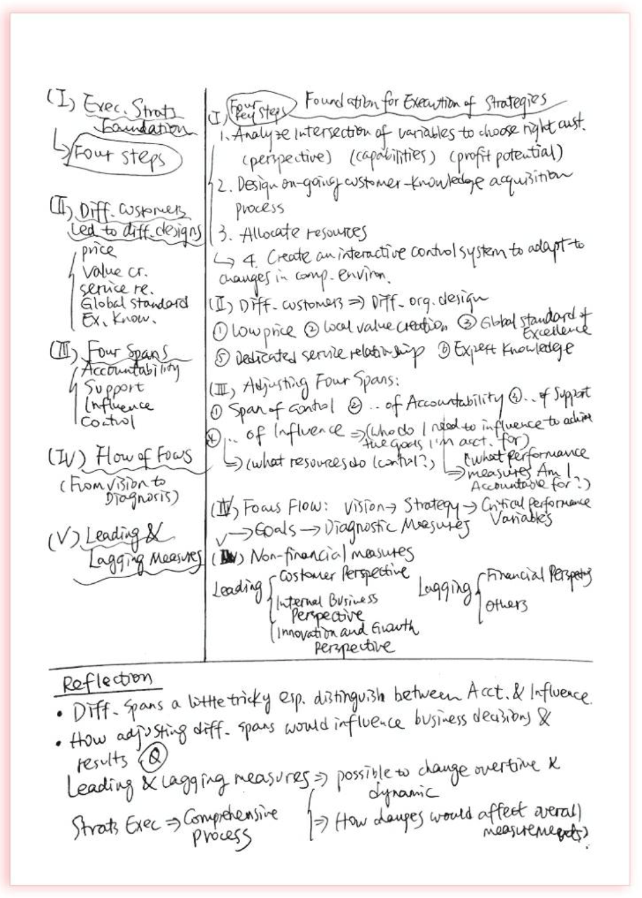
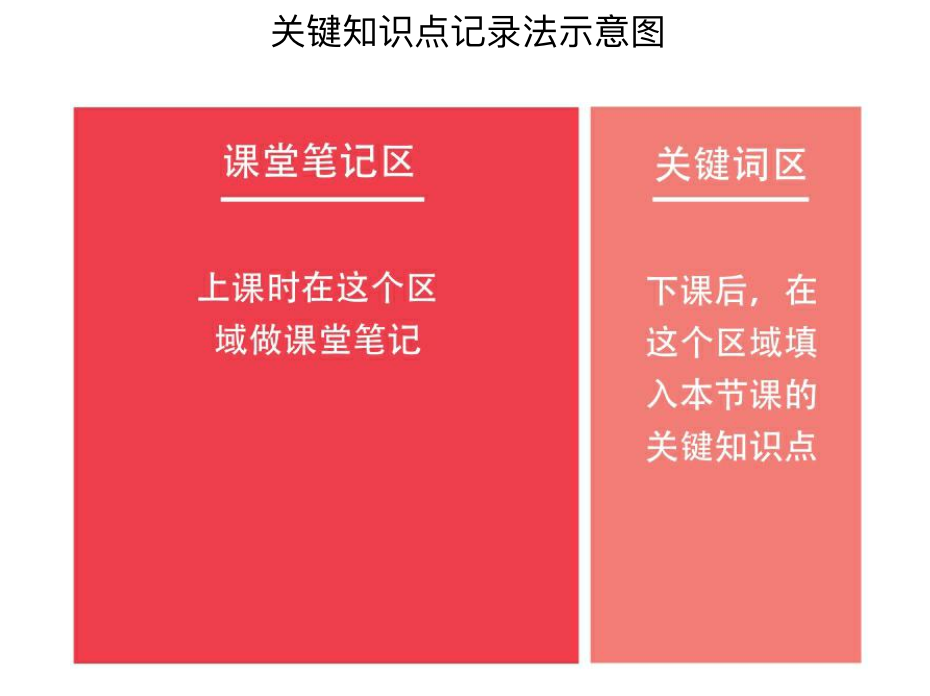
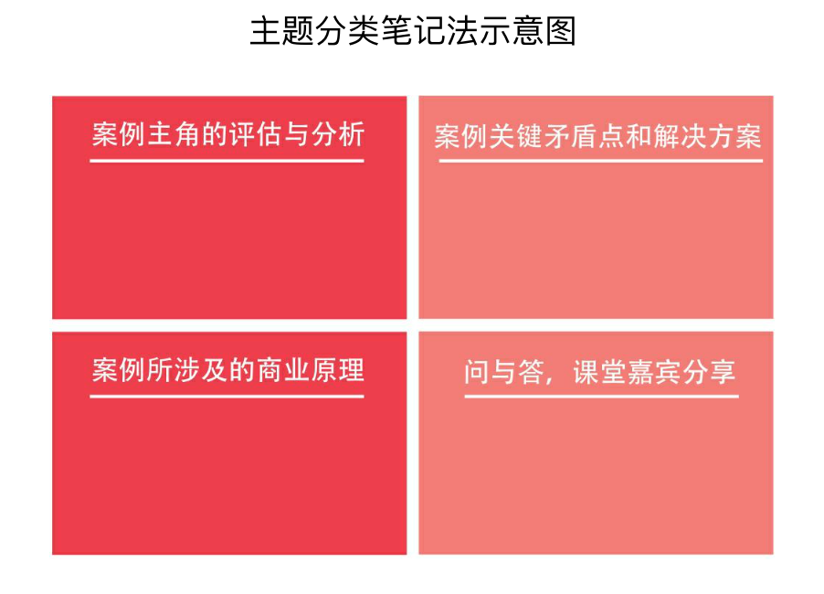
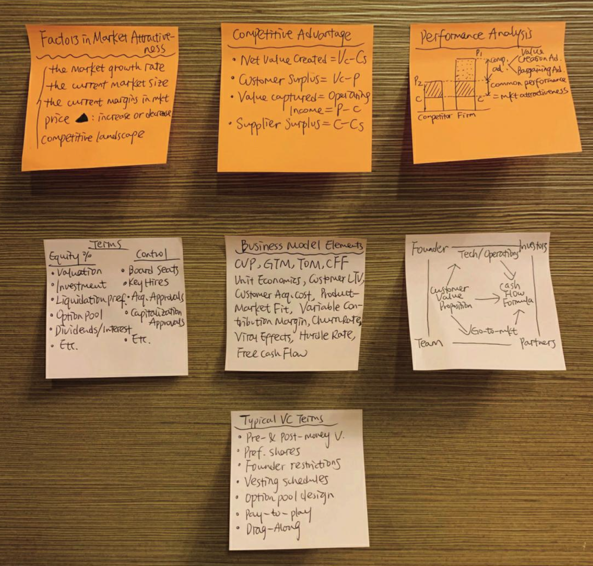

### 第1课 高效记忆，更快更牢掌握知识点

“如何提高记忆力、又快又好地把东西记牢记熟”是困扰不少同学的老大难问题。面对必须背诵的古诗词、历史事件，或者数理公式，很多人要么怎么都记不住，要么记完了之后又忘得特别快。

有些同学在考前临时抱佛脚，抓耳挠腮地抱着书死记硬背，到了考场发现题目似曾相识，答案却怎么也想不起来。有些同学背单词，完全就是举起书一个一个机械地往下背，背到一个词就重复读几遍，比如“apple，apple，苹果，苹果，apple，苹果”，然后就觉得大功告成了。结果过一会儿再回看，发现基本都忘光了。因为一而再、再而三地记不住，不少同学会进入自我否定的恶性循环，最后甚至放弃了。

事实上，我们绝大多数人并非天才，做不到过目不忘、“秒记”是很正常的。很多同学记不住东西绝非因为智商低，而是因为没有掌握提高记忆效率的方法，或者说，总是一个猛子扎进去死记硬背，压根儿没有思考过应该怎么去记东西，效果当然非常差。

记东西虽然着实令人头大，但如果掌握了好方法，就能事半功倍。一旦把知识点记牢了，你的考试分数和排名一定会有明显提升。即便只是背熟一个知识点，你在某次考试中也可能多得3分、5分。这看上去微不足道的几分，或许会对你的升学乃至命运产生关键性的影响。所以，无论如何都别因为畏难而轻易放弃。

从小学一年级到哈佛硕士毕业，我记了将近二十年的海量知识点。背东西有意思吗？实话实说，当然不好玩。但面对枯燥甚至有时让人崩溃的记忆任务，我总会提醒自己：咬牙顶住，决不退缩。此时心志和筋骨上的疲累，终将转化成升学目标实现那一刻的无上喜悦。

同时，我还总结了能让记东西不那么“难熬”的三大关键：

第一个关键，是要努力把记忆过程趣味化，加入一些生动和有趣的元素，只用眼看、用嘴念是非常枯燥的记忆形式。

第二个关键，是把表面看上去散乱无规律的东西努力地串联起来，变个体为整体，做有规律的整块记忆。

第三个关键，尽量借助自己已经熟悉、知道的内容去记忆新知识点，以旧带新。

下面，我将基于这“三个关键”，逐一讲解我自己最习惯使用的五大记忆法。


#### 第1小课　多感官刺激记忆法

多感官刺激记忆法，就是同时动用我们的多种感官，比如视觉、听觉和嗅觉等，来进行记忆。

也许你会问，记东西为什么还要用到听觉甚至嗅觉呢？和这些感官有什么关系呢？其实，当多种感官齐发时，大脑受刺激的效果会显著增强，记忆中枢能获得更充分的调动。

作个“简单粗暴”的类比：某个夏日午后，你热得汗流浃背。如果这时让你喝一杯冰可乐，你肯定会觉得解渴，但可能还是觉得热。而如果让你一边喝冰可乐，一边在凉爽的空调房里坐着，你一定会感到更加舒爽，解暑也更加彻底，因为这时你的皮肤（触觉）、味蕾（味觉）同时在感受凉爽。

同理，回到记忆这件事上，以背单词为例：如果你只是用眼睛盯着新单词记忆，相当于只刺激了视觉区域，无法对大脑形成足够刺激，达不到很好的记忆效果。在背单词时，一定要动用自己的听觉。具体做法有两个：一是在碎片时间里戴上耳机，听单词音频；二是尽量抽时间做单词听写练习。比如，你现在要背四六级单词，那么请一定选择配有音频的单词书（或其他背单词材料），每天确保至少听三次音频，并且我建议你把这三次拆分成“1+2次”。


##### “1+2次”记忆法

“1+2次”中的“1”，指的是在背诵新词当天就要同步听录音。在开始背诵新词前，至少先完整地听一遍新词音频，听的同时浏览对应的新词，建立对这些词最初的印象。背诵到具体某个词时，如果时间允许，可以再听一遍与其对应的录音。把当天所有新词都背完后，再完整地放一遍音频，一个词一个词地听下去，听的时候尽量不看书，逼自己快速拼读出单词。如果某个单词卡壳了，就重听一遍那个单词的音频，再次尝试记忆，直到熟练为止。

“1+2次”中的“2”，指的是一天结束前至少再利用两段碎片时间，听两遍当天的任务单词音频。比如，你可以在中午吃饭时听一遍，在晚上睡前再听一遍。听的时候仍然要逼自己同步拼读单词，遇到没记住的词就立即回到文本再背一遍，直到记牢为止。


##### 听写练习记忆法

另一个记忆的好方法，是做听写练习。如果时间有限，你可以把听写和纯听单词音频结合在一起，听的时候就准备好小本子，同步听写。如果时间充分，还可以每天抽出15—20分钟时间专门做一次听写练习，遇到拼不出来的词就快速地回到书本进行二次记忆和复习。

和背单词类似，古诗词记忆也可以使用多感官刺激记忆法。比如，背诵苏轼的《念奴娇·赤壁怀古》时，我们就可以把周杰伦谱曲演唱的《念奴娇》这首歌下载下来听：“大江东去，浪淘尽，千古风流人物。故垒西边，人道是，三国周郎赤壁。”边听歌，边体会，确实能记得更清楚、牢固。

我还记得自己在中学背诵苏轼的《水调歌头》和李煜的《相见欢》时，就配合着听了王菲和邓丽君演唱的以这两首诗词为蓝本创作的歌——《明月几时有》以及《独上西楼》。和诗以歌，将古诗词配以现代流行音乐，同时刺激视觉与听觉，记起来就快了不少。

除了听觉，我们还可以调动嗅觉和味觉。比如，背“chocolate”（巧克力）这个单词时，也同时吃一小块巧克力，边嚼边记，当再次吃到巧克力的时候就更容易回忆起这个单词，或者在看到“chocolate”这个词时就想起了当时的味道。

说来有趣，在所有同水果相关的单词里，除了apple和banana这样的常见水果外，我记得最牢的当属“durian”（榴梿）这个词。为什么呢？我上小学三年级时，父亲有次到马来西亚出差，顺便带了当地的冰冻榴梿回家。我在品尝这种味道独特的水果时，妈妈在一旁笑着说：“知道榴梿的英语怎么说吗？durian，durian，durian……”

一边是“上了头”的又臭又香的榴梿滋味，一边是妈妈清亮的英语复读，从此我对durian印象深刻。


#### 第2小课　缩略词记忆法

我常用的第二个记忆方法叫“缩略词记忆法”，无论是记单词还是背诵大段的史、地、政，这个方法都特别实用。可能不少同学对缩略词记忆法耳熟，但几乎没用过，那么不妨在读完我下面的介绍后就尝试起来。

当我们需要记忆一个系列的知识点时，不要马上开始从头到尾、逐字不差地记忆完整内容，而是把这个知识系列拆分成若干个片段，或者说是<u>**“关键元素”**</u>，接着把这几个关键片段的元素组成一串缩略语。我们首先把缩略语记熟、记牢，再通过这串缩略语，**以点带面**地记好全部内容。之后，每当我们看到这串缩略语时，就能根据关键元素，逐一回忆出所有内容。

这么说可能有些抽象，那就举一个几乎我所有美国同学都耳熟能详的例子：北美洲有著名的五大湖，包括苏必利尔湖（Lake Superior）、密歇根湖（Lake Michigan）、休伦湖（Lake Huron）、安大略湖（Lake Ontario）以及伊利湖（Lake Erie）。这五个词乍一看没有任何关联和规律，但如果我们把它们的首字母抽出来再看呢？S、M、H、O、E——好像还是没看出什么门道。再把这些字母的顺序调换一下呢？是不是就变成了——H、O、M、E、S，也就是英文单词home（家）的复数形式homes？这时，我们就把五个单词变成了一串缩略语——homes，然后就可以想象在湖面有许多房屋（homes）。由此一来，记忆北美五大湖就变成了以HOMES这个缩略词为线索，再通过每个字母记下其相对应的湖泊名称。记忆过程瞬间简单了许多，记忆效果却更加牢固。

在哈佛商学院攻读MBA时，我每天都要研读大量商业案例，记忆和理解纷繁复杂的商业原理。所幸不少知识点都可以通过缩略词记忆法，被概括成简练的关键词串，记忆难度也相应降低。比如，营销学教授杰瑞·麦卡锡提出的“4P理论”，就是将产品推广时需要考量的四个关键因素总结成了四个以“P”开头的单词，包括people（人，核心用户群是谁）、place（地点，应该在哪些区域进行推广）、price（价格，产品应该如何定价才最吸引消费者）以及product（产品本身应该具备哪些属性特质才富有竞争力）。诸如“4P”理论的缩略词商业原理还有很多，我几乎每天在哈佛都会学到、用到。不得不说，通过缩略词法去记忆抽象繁复的知识点，真的非常有效。

另外，学过财务会计的同学可能对这个概念比较熟悉——在计算物资存货成本时可以用到的几种方法包括先进先出法、加权平均法、移动加权平均法、个别计价法以及后进先出法。虽然逐个背诵并非不行，但记起来比较费力，还容易遗忘。如果我们把这五个名词的第一个字择出来，组成一个缩略词串——“先加移个后”，然后再去相应记忆呢？是不是就更容易了？以后每次需要复述这五种方法时，都可以从“先加移个后”开始，就会顺利得多。

你也开始试试吧。


#### 第3小课　联想记忆法

我要讲解的第三个记忆方法叫“联想记忆法”，和缩略词记忆法一样，也是很多人听过却没真正用过的一种方法。联想记忆法主要包含以下几种最重要的分类和用法。


##### 接近联想

“接近联想”，就是利用相互接近的事物进行联想和记忆。在记忆一个知识点的时候，自然联想起和它有相同或类似属性的另一个相近知识点。这样一来，我们就将片面知识的单个记忆变成了多个知识的立体记忆，从而显著提高记忆范围与效率。

知乎平台的记忆力大V馨月老师就分享过“用接近联想记忆法记历史事件”，我后来也在参考使用。举个例子，当你学习我国汉朝历史、了解大汉王朝的强盛时，就可以思考一下，同时期，世界其他地方是否存在和汉朝相当的强大国家呢？这时候，你就可以联想到罗马帝国。通过汉朝想到了罗马，它们都是伟大的王朝帝国，这就是重要的相近属性。从汉朝联想到罗马帝国还没完，我们还能继续延伸，想想这两个国家为什么在几乎同一时期变得如此强大？当时各自发展与崛起的背景是什么？两个国家都发生过哪些大事件？它们兴盛的共同因素是什么？等等。

从这个例子我们可以看出，接近联想不但可以跨时间和空间以点带面，还非常有助于知识面的拓宽，从整体记忆的过程中提炼出共同的基本特征与属性，从而加大学习的广度和深度。


##### 相似联想

“相似联想”和接近联想虽然听上去很像，却有本质的使用区别。相似联想，主要是通过联想一个看上去相近的具体图像，来记忆一个新知识点。

举个非常通俗的例子：当你记忆中国地图时，如果生硬地去记哪座山在中国的哪个区位、哪条河流经什么省，可能不太容易记住。但如果你把中国地图想象成一只雄鸡，鸡冠是什么位置，对应了什么省份，有哪些山川河流；鸡尾是什么省份，有哪些重要城市和名胜古迹，这样记忆起来就容易多了。类似地，你还可以把意大利的领土形状想象成一只靴子，把日本联想成一条蚕或一只海马，把伊朗的轮廓联想为一顶草帽……

所以，相似联想的精髓是把抽象陌生的新事物生动化、具象化，通过联想自己熟悉的形状、图像来达到降低记忆难度的目的。


##### 归类联想

第三种联想记忆方法叫“归类联想”，这个其实也不难理解。俗话说“物以类聚”，我们在记忆新事物的时候，可以把它和相同类别的东西捆绑起来，统一记忆。举几个很简单的例子：比如，你在吃牛油果的时候，可以想到，牛油果是一种原产于海外的热带水果，然后顺便联想记忆类似属性的热带水果，比如百香果、榴梿、山竹等。

又如，在我国文学史上，诗词家多如繁星，我们可以根据相近的风格或时代将他们归入特定流派，统一记忆。比方说，晋代的陶渊明、唐代的杜甫和白居易以及宋代的陆游就都可以被划进“现实主义流派”，而这一流派诗作的共同特点是能够真实形象地反映社会生活。


#### 第4小课　晨起／睡前记忆法

我在耶鲁选修过一门很有意思的历史课，主题是“日本列岛史”。不过，有趣归有趣，难度也颇高——通过一学期的三十多次大课，密集研讨日本从公元前神武天皇建国到1868年明治维新的历程，时间跨度超过2500年，涉及的知识量大、知识点碎。要想在大考和期末论文中获得好成绩，就必须把课堂内容掌握扎实。

那一整个学期，我都在用晨起／睡前记忆法来对付课程中繁杂的知识点。早晨七点多起床后快速洗漱，到学院食堂边吃早餐，边用十分钟时间记忆最近刚学的日本历史要点——公元4世纪的大和国为何能成为日本的首个统一政权？到唐朝的日本留学僧（遣唐使）都取过哪些“真经”？德川家康最信任的人是谁？深夜入睡前，我也经常拿出日本列岛史的阅读材料和课堂笔记，再次温习、记诵各种细密的知识。

晨起和睡前记忆，竟然帮我获得了过目不忘的体验——这门课的知识点我记得扎实，结课时的成绩也很好。甚至在写这篇文章的此时此刻，我都还能忆起八九年前选修日本列岛史时背过的诸多细节。


#### 第5小课　故事串联记忆法

最后要介绍的记忆方法叫“故事串联记忆法”，也是我自己需要短时间记忆零散知识点时经常会用到的。

前面说过，机械地硬记独立知识点难度较大，遗忘率也高，因为独立的知识点缺乏上下文的背景信息参照。但如果我们把每个知识点“零件”都串联起来、编成一个小故事，把它们放到有上下文的语境中，就仿佛给了这些知识点生命，让它们变得更生动具象，也更好背了。

在这里跟大家分享一个“故事串联记忆法”很典型的案例：夏目漱石是日本著名作家，他的主要作品有《我是猫》《草枕》《虞美人草》《三四郎》《从此以后》《门》《行人》《道草》《明暗》等。这么多的作品如果要按顺序一个个快速地记准、记牢，还真没那么容易。但日本著名的记忆大师坂井照夫利用“故事串联记忆法”，轻而易举地把这些作品依次都记了下来。他是这么“讲故事”的：“我们是这间屋子里的猫，枕草枕睡觉，草枕上画着虞美人草，三四郎从此入门进到屋里，门前蹲着来往行人，行人在采道草，道草是有明暗之别的道路。”

也许一些同学会觉得，这则小故事的情节听上去怎么怪怪的，个别地方有点讲不通啊？但是，不必过多地纠结故事编得好不好、在不在理，即使情节诡异也没关系，只要你能通过这个故事把所有需要记忆的信息串联起来，让它们在上下文中变得更生动好记，那么降低记忆难度、提高记忆质量的目的就达到了。


#### LEO的学习仪式感

##### 10天背完4000个GRE单词，我是如何做到的？

到这里，我就介绍完了自己亲测好用的五种记忆方法。必须说的是，方法固然会有帮助，但记忆这件事真的没有捷径。不管用哪种高超的方法，都首先需要你高度专注、肯下苦力。在应对一项记忆任务时，永远不能抱有侥幸心理，不可偷懒、懈怠。

下面，我再和同学们分享自己高三上学期请假备考耶鲁大学时，用10天时间背完4000个GRE单词的“拼命三郎经历”，希望能通过这段故事，给你打一针强效鸡血。

读高中时，我的升学目标是耶鲁大学，而申请美国本科就必须考SAT，也就是我们国内俗称的“美国高考”。当时由于时间有限，我必须一次性获得SAT高分，需要在10天内集中突击把难度很大的GRE单词一举拿下。GRE是美国研究生入学考试，里面的单词有多难呢？我可以这么告诉你，有相当数量的GRE单词，就连很多美国人一辈子都没见过、没听过、没概念。

当时我买回“GRE词汇红宝书”，里面林林总总涵盖了9000个GRE词汇，除去自己已经掌握的5000个托福词汇，我还需要搞定剩下的4000多个新词。10天集中突击的计划，意味着我平均每天要干掉400个词。

定好了目标，我就立马开始了抱着红宝书疯狂背单词的240小时。说实话，这个记忆量确实是“杠杠的”，之后和美国同学聊起这段经历时，他们惊讶得下巴都快掉了，连说——Leo，no way，that was impossible！（Leo，不可能，这绝不可能！）其实，现在回想起那10天的疯狂，我都觉得有些难以置信。当时真的就是一股劲在支撑着自己，每一天都是咬牙扛下来的。那几天，我和红宝书形影不离，枕头旁是红宝书，被窝里是红宝书，键盘上是红宝书，浴缸边还是红宝书。

我具体是怎么快速记下这4000个生词的呢？坦率地讲，当时我没有走任何捷径，只有尽量用高效、科学的记忆方法。我把自己的背词法总结为“六步鸡血背单词法”（如下面内容）。简单来说，就是多感官刺激、反复磨耳、结合音节和释义做单词拆分，并且特别注意把单词放在例句中做上下文理解记忆。

- 第1步　直接拼读，完整朗读一遍单词和中文意思
- 第2步　拆分单词，拼读音节
- 第3步　逐个拼读每个音节中的每个字母
- 第4步　用三种不同的升降语调朗读单词（模拟真实语境中单词的不同音调）
- 第5步　将单词中的每个字母一一拆分并拼读，最后再次读出单词和中文意思
- 第6步　将单词放在例句中，读一遍句子，强化记忆

例：

1）global [ˈɡloʊbl]全球性的，全世界的

2）glo-bal

3）g-l-o-glo, b-a-l-bal

4）global, global, global

5）g-l-o-b-a-l global全球性的，全世界的

6）Air pollution is a global problem.空气污染是全球性的问题。

我还在背单词时积极“举一反三”：在按字母顺序背过一遍后，我又从网上下载了分类词库，看到“fastidious”（挑剔的）这个词时，马上在眼前和脑海中联想近义词picky、critical、stringent，背一个词的同时复习五六个词，事半功倍。

另外，我坚持“听单词入眠”，也就是上面介绍过的“多感官刺激记忆法”和“睡前记忆法”。我会把MP3放在床头柜上，循环播放词汇音频，任由一个个单词的发音通过听觉刺激大脑记忆中枢，直到自己累得沉沉睡去。第二天早上醒来时，MP3经常已经没电关机。在复习时，往往发现前一晚“听背”的单词都已记得非常牢。

再有就是不服输的那股劲，一种走火入魔的状态。跟妈妈聊天时，我会突然走神，念叨出刚在脑子里安家的单词，我会逼我妈随时随地考我记在小本子上的难词，以至于那几天她见了我就想躲；看电视新闻时，我会不自觉地将播音员念出的中文词实时翻译成英文；就连有时说的梦话，都会用上红宝书里的词汇。

而这10天的背单词炼狱之旅，不但十分给力地助我一次性考出了SAT高分，还让我在往后几年的耶鲁求学中，阅读大宗英文书卷时几乎没有遇到困难；让我在撰写任何种类的论文时，都能自如地运用各类词语和用法，准确地描述自己的观点，同样重要的是，这段经历也刷新了我对自己记忆潜力的认识，让我意识到，只要肯吃苦，没有什么是记不下来的。

跟大家分享这段“10天4000词挑战”的荡气回肠的经历，绝不是要夸耀我自己，而是想在介绍了这么多方法和案例之后，再给同学们打一针强心剂。世上无难事，只怕有心人。和大多数同学一样，我不是天才，有一个公式在我们身上是共通的，那就是——高效方法+不懈努力＝成功与喜悦。所以同学们，逼自己一把，现在就开始尝试我推荐的记忆方法。我相信，你会收获惊喜。


#### 本课核心方法回顾

##### 高效记忆的三个关键点

- 第一大关键：努力把记忆过程趣味化，加入生动有趣的元素。
- 第二大关键：把待记忆碎片信息连成整体，做有规律的整块记忆。
- 第三大关键：借助自己熟悉的内容来记忆新知识点，以旧带新。


##### LEO亲测好用的五大记忆能效提升方法

- 多感官刺激记忆法：充分调动视觉、触觉、嗅觉、味觉等不同感官提高记忆效率。
- 缩略词记忆法：以关键词、缩略词对冗杂信息进行概括和整合，提高记忆力。
- 联想记忆法：运用接近、相似、对比、因果等关系，进行联想记忆。
- 晨起／睡前记忆法：选择记忆新事物的最佳时间段来提高记忆效果。
- 故事串联记忆法：通过自编故事把待记忆的零碎信息串联起来、降低记忆难度。


### 第2课 超级笔记，透彻吸收课堂所学

做学习笔记是每个学生都知道的一件事，却也是最常被忽略、最容易做不到位的一件事。

其实何止是被学生忽略。你是否意识到，不管是老师还是家长，都鲜有人系统地教过我们到底该如何科学、高效地做笔记？我甚至遇到过这样的老师：他们认为记笔记是一件比较主观的事情，还得看学生本人的习惯偏好，因此不需要专门讲解笔记方法。

做学习笔记时，你是否基本“跟着感觉走”，或者只是照别人的样子依葫芦画瓢？

你是否对如何抓重点一窍不通？或者，恨不得把老师说的每一句话、写的每一行板书都全盘抄下来？又或者是另一个极端，相信老师讲的内容都能在书上找到，自己上课时也听得很明白了，所以根本无须做课堂笔记？

你是否觉得做笔记就是一次性任务，只需在上课时记上一通，下课后就高枕无忧了，很少拿着笔记做定期复习？或者，即使有意识地在考前拿出笔记本，却不知该从何看起？

你是否知道，做笔记的方法多种多样，可以匹配不同的学习场景和学习目的？

善做、善用学习笔记的人即使智商平平，也有更多机会获得佳绩，因为做笔记本身，就是课堂之外的又一次完整、深入的学习。接下来详细分享我自己亲测好用的几种学习笔记法。不论你处于求学的哪个阶段，都可以从中选择一两种试用起来。


#### 第1小课　康奈尔5R笔记法

我力荐的第一个方法是“康奈尔笔记法”（Cornell Note-taking Method），由美国著名常青藤盟校——康奈尔大学的教授Walter Pauk在其著作How to Study in College中首次介绍，并在此后的半个多世纪里渐渐风靡全球。在耶鲁读本科时，我第一次从写作中心辅导老师那儿接触到康奈尔笔记法，而身边的同学中也不乏这个方法的拥趸。

康奈尔法是一种系统、完整的笔记方法，涵盖了从课堂记录到课后复习的全过程，下面讲解具体的操作步骤：

首先，将笔记本分成三个部分，我把这三部分总结为“右大左小下长”。右边部分占整个页面70%的篇幅，叫作“主栏”；左边部分是“副栏”，下方部分是“总结区”，这两部分各占整个页面15%左右的空间。当然，大家也可以根据个人喜好，把纸面设置成“左大右小下长”。

将整张页面划分好后，我们便可以开始康奈尔笔记法的第一个步骤。以下我列出了五个以R开头的单词，因为康奈尔笔记法还有一个别名，叫“5R笔记法”。这五个以R开头的单词，也分别对应了康奈尔笔记法的五个关键使用步骤。


##### Record，记录

第一个r是“record”，记录。上课听讲时，我们在右边的“主栏”中实时记录老师讲课的内容，着重参照课堂板书记下新知识点和案例，但无须逐字逐句“听写”老师的上课原话。所以这一步理解起来很简单，就是同学们最熟悉的“上课记笔记”。


##### Reduce，简化、简写

第二个r是“reduce”，简化、简写，对应康奈尔笔记法的第二步。下课后尽快抽出10—15分钟，复习上课时在主栏记录的笔记内容，再将里面最核心的知识点提炼出来，以关键词、关键短语和短句的形式写入左边的“副栏”中。这也是康奈尔笔记法从课上延伸到课下的第一步。


##### Recite，背诵、记忆

第三个r是“recite”，背诵、记忆。在这一步我们该做什么呢？顾名思义，要通过一定的记忆工作，完成对课堂所学的复盘和巩固。在上课当天结束前，再次抽出10—15分钟，拿出笔记本，用手遮住主栏，只看副栏中的关键摘要，然后尽可能完整地复述并记忆课堂内容。


##### Reflect，思考、回顾

第四个r是“reflect”，思考、回顾，也是第三个步骤——recite的延伸。在这个环节只需做一件很简单的事：把自己的听课随感和上一步复习笔记时遇到的困难和问题写在页面下方的“总结区”里。


##### Review，复习

第五个步骤（也是康奈尔笔记法的收尾步骤）是“review”，复习。在听课后的几天里，根据自己的实际学习情况，进行n次、每次10—15分钟的笔记复习。这里的“n”完全由你决定，如果在经过前面几步后对课堂所学仍然掌握不好，则可以多次复习；反之，则可以“一遍过”。复习时，尽量先看副栏里的关键知识点摘要，努力回忆相关内容，之后再回到主栏，仔细回顾全部知识点和对应的细节。我更建议大家把康奈尔笔记本和教材、习题集、试卷结合起来复习，尽力避免遗漏知识弱点和盲点。关于复习的详细方法可以移步阅读第4课（33页）。

可以说，康奈尔法是我自己用得最顺手的一种笔记方法，其完整性尤其有助于知识点的巩固。每一次完成从做随堂笔记，到课后及时整理归纳，再到之后多次循环复习的过程，我都会觉得特别踏实、安心。

印象尤其深刻的是大一上学期开学时上微观经济学课，那是我人生中头一回用全英文学习经济学，起初颇为不适应，上课时也常有知识点听得似懂非懂、模棱两可。但多亏了康奈尔笔记法的五个步骤督促自己按时进行课后总结、回顾和复习，我才得以及时弥补了各种知识漏洞，也才能在这门课程的期末考试中拿到了全班为数不多的A。

在这里一并分享我在大学课堂上做过的康奈尔笔记。耶鲁是全英文上课，因此我的这份笔记里没有中文，大家不妨顺便练练英语阅读。



另外，如果你最近实在忙到没时间完成康奈尔笔记法的五个步骤，也可以试试康奈尔笔记法的简化版——“关键知识点记录法”。这种方法把页面分成了左右两部分。我一般习惯把占页面80%的“课堂笔记区”放在左边，20%的“课后关键知识点提炼+复习区”放在右边。下面随附这种方法的示意图和简单讲解：




#### 第2小课　主题分类笔记法

无论是康奈尔笔记法还是简化版的关键知识点记录法，其亮点都在于覆盖了从课堂听讲记笔记到课后归纳和温习的全过程，有助于我们提高对新知识的反刍和内化。不过大家仔细想想，这两个方法是否存在什么不足之处呢？

如果非要鸡蛋里挑骨头，那么用于做随堂笔记的“笔记区”就有待完善。结合上课场景，想想有什么可以优化的点？

通常而言，老师在一堂新课上会讲解不同内容，即使只围绕单一知识点讲课，也会涉及知识原理／概念介绍、例题讲解等不同方面／环节。在使用康奈尔笔记法时，我们主要按照**时间推移**的顺序做笔记，即：老师讲到哪儿，我们就记到哪儿。

除了基于老师讲解的时间先后做随堂笔记，我们还可以尝试以一节课覆盖的不同内容为线索做笔记，而这也是“主题分类笔记法”的精髓。

举个我自己的例子大家就能“秒懂”：哈佛商学院的每节课通常会围绕一个商业案例展开深度研讨。在每节课的90分钟（或更长时间）里，教授一定会把商业案例拆分成几个不同板块（也可称为环节／主题）来讲解，最常见的划分是：

1．案例主角（比如公司CEO、投资方、用户等）的讨论与评估

2．案例关键矛盾点（比如企业治理触犯了当地法律法规）和解决方案的分析

3．案例所涉及商业原理（比如市场份额增长战略）的讲解

4．下课前的“问与答”环节，或课堂嘉宾分享环节

因此，根据这些“高度可预测的”主题分类，我会提前把笔记本页面划分成“n宫格”（n≥2），每格对应一个课堂环节，比如上面举例的划分方式。在上课时我会高度专注，跟紧教授的节奏，每进行到一个环节时，就在相对应的格子里做笔记。



经过分门别类后，课堂上的不同所学就更加一目了然了。课后我们也能轻而易举地对照着笔记，评估不同主题内容的学习情况，更有针对性地完成复习。

只要稍作思考就会发现，主题分类笔记法适用于任何科目。比如：

- 一节语文课可以划分成：

  1．课文内容（中心思想、写法赏析等）

  2．作者（生平、写作风格等）

  3．语言知识（文法、字词表达等）

  

- 一节理科课（数理化生）可以划分成：

  1．基本公式定理

  2．延伸变体公式定理

  3．基本公式对应例题

  4．延伸变体公式对应例题

  

- 一节外语课可以划分成：

  1．词汇与句型

  2．语法点

  3．口语表达与发音

  4．听力练习

  

同学们可以在读完本篇后，任意选取一节课做主题划分，在下次上课时**尝试主题分类笔记法，相信会有耳目一新的体验**。


#### 第3小课　移动笔记法

提到记笔记，大多数人的第一反应是“笔记本必不可少”，然后不由自主地联想起坐在教室里边听讲边奋笔疾书的情景，又或是阅读时一本书、一支笔、一个本儿，一丝不苟做读书笔记的样子。总之，记笔记＝郑重其事地做记录。

但其实，做笔记的方法远不局限于康奈尔笔记、主题分类笔记以及精读时的笔记。我们没法无时无刻不带着笔记本，却应该尝试随时随地通过记笔记来巩固日常所学。

“移动笔记法”就是一个更加轻松、灵活的记笔记方法。“移动”对应的是英文中“portable”一词，也就是“便携的、可移动和携带的”之意。笔记如何“移动”起来呢？这就有赖于记笔记的工具了——便利贴和闪示卡。便利贴大家一定不陌生，这些正方形／长方形的彩色贴纸是文具店里拥有极高人气的存在。“闪示卡”的英文是“flashcard”，在西方国家尤其流行，是几乎每个学生的必备学习工具，和便利贴的差别在于不带贴胶，主要由学习者随身携带使用（比如放在口袋里）。

移动笔记法相较传统笔记法的一大优势不言而喻：可以携带、可以随时随地查看和使用。另一个优势也很明显——无须耗费过多时间和笔墨做详细记录，只需把涉及知识点的**关键词、关键定理**等言简意赅写在便利贴／闪示卡上即可。

这个方法既适用于课堂听讲做记录，还能在考前冲刺复习时发挥奇效。当同学们备战重要考试时，需要复习的知识点繁杂琐碎，还经常四散在课本、教辅、笔记本等各种学习材料里。这时候就可以把关键知识点写在便利贴上，再将便利贴贴在醒目区域，比如书桌上、床头柜上或者冰箱门上，之后每次经过时不费吹灰之力就能查看和复习。

下页图展示的是我在哈佛宿舍的一面墙，上面贴了两种颜色的七张便利贴，一种颜色对应一门课，记录的是我过去一周时间里在商业战略课和创业课上学到的“热腾腾”的核心知识点，每天都能轻松查看。根据对课业内容的掌握情况，我平均每周贴5—10张便利贴笔记，第二周再更换新的贴纸，用于记录和温习新一轮的知识要点、难点。通常而言，我不会让便利贴“过周”。也就是说，**前一周记在便利贴上的内容必须在当周结束前理解透彻，绝不拖延到下一周**，以致变成“慢性疑难杂症”。



<center>我在哈佛宿舍墙上的便利贴笔记</center>


用闪示卡做关键知识笔记的方法略有不同。首先准备好一定数量的flashcard；随后在卡的正面写下一部分信息，在背面写下另一部分信息。比如，正面记录一个问题，背面写下针对这个问题的标准答案以及所涉知识点。如果用闪示卡笔记法背单词，就可以在正面写中文释义，背面写相对应的英文单词、音标、词性和例句。最后，把准备好的闪示卡放在书包或口袋里，随时拿出来复习、自考。高三上学期用10天攻克4000个GRE难词时，我就买了厚厚两大摞闪示卡，每天睡前抽出10—15分钟，把尚未背会的单词一一记到卡上，在之后几天里不断回顾自测，直到完全掌握为止。

不管是用便利贴还是闪示卡，移动笔记法都可以帮我们提高在碎片时间里的学习效率，非常好用。用这个方法一周也许觉察不到明显变化，但如果能坚持一个月、半年、一年，你一定可以在不知不觉中夯实所学、获得长足进步。


#### 第4小课　录音笔记法

除了以笔和纸为工具的各种常规方法，我们还可以稍作创新、另辟蹊径，以录音的方式记笔记。在“记忆法”这篇里我介绍了“多感官刺激记忆法”，讨论了通过动用多种感官来提高记忆功效。其实，这种办法在做学习笔记时同样适用。

很多同学都有同样的苦恼：

“我当然想在课堂上又快又好地把老师的讲解一字不漏地记下来，可是要么自己写字速度太慢，要么老师讲得太快，要么一个知识点太冗长，做笔记真的来不及啊！”

这个时候，“录音笔记法”就能发挥作用了。具体如何操作呢？上课时，老师正在讲解的某个知识点内容庞杂，还下分了若干个小知识点，你没法一一记在本子上。这时候别着急，你要做的就是全神贯注听讲，尽可能不遗漏任何一个核心要点，并且争取把大部分内容听懂。在专注听讲的过程中，为了辅助记忆，你也可以把老师讲解的要点以短句或关键词的形式记在本子上，但注意：一定不要让写字耽误了听讲。同时，明确好老师当前所讲的知识点对应了教材的哪一章、哪一篇、哪一页，越精确越好。

下课后找一个安静的地方，把老师在课堂上对知识点的讲解和课本内容结合起来，接着用自己的语言尽可能完整、详细地复述一遍，并录成音频存在手机上。保存时记得在文件名中把学科、日期和相关知识点标注清楚。做完这一份“录音笔记”后，你就可以利用碎片时间——比如独自吃饭时、坐公交车搭地铁时，随时播放回听，从而达到反复温习的目的了。当然，在对课堂所学进行复述录音时很难一帆风顺，难免会在课堂上没听懂的地方卡壳。此时你可以暂停录音，再次回顾教材中的相关讲解；如果依然在理解上有困难，就该立刻把疑难问题记下来，及时请教同学或老师。

结合我个人的经历需要补充说明的是，录音笔记法更适用于文科范畴，尤其是经常要背诵大段知识点的历史、地理和政治科目。打个比方：中学历史课上的一个经典知识点是“辛亥革命的意义和其对之后中国革命的影响”，这个问题的满分回答包括几个大点和若干小点。除了可以把老师的课堂讲解和板书记在笔记本上，或者直接背诵教辅书里的标准答案以外，你还**可以把这个知识点用自己的话完整复述一遍，并录音保存好**，在碎片时间里回放温习，通过刺激听觉来加深记忆和理解。

即使你是住校生，学校禁用手机也没关系，你依然能在回家时使用录音笔记法。我可以很有把握地说，这个方法虽然听上去有些“非主流”，但的确有“神奇功效”。


#### LEO的学习仪式感

##### 用缩略词&符号为笔记提速

我在上面介绍“录音笔记法”时提到了一个广泛痛点：课堂节奏和老师语速太快，大家做笔记经常会来不及；如果逐字逐句记录完整，就可能无法跟上后面的讲解。我在读大学时也有过类似经历，尤其对一位讲起话来像说绕口令，并且带着浓重南亚口音的印度裔经济学教授印象深刻。为了能跟上这位教授的课，我当时自创了一套缩略词集&符号表，专门用于在节奏飞快的课堂上记笔记，效果很好，在这里一并分享。但我的这一套内容更适合英语学习环境，所以同学们也可以稍加参考，再做一套自己用起来得心应手的缩略词集&符号表。


##### LEO的缩略词集&符号表

```
∵ 因为（because）
∴ 所以（therefore）
☆ 重点（key point）
= 等于（equal）
≈ 大约（about）
＞ 大于（more）
＜ 小于（less）
△ 变化（change）
+ 加、并且（plus，and）
↑ 增加（increase）
↓ 减少（decrease）
etc.等等（etcetera）
w/ 有（with）
w/o没有
i.e.即（that is）
&和（and）
Ans.答案（answer）
esp.尤其（especially）
e.g.举例（for example）
vs.对抗（versus）
？问题（question）
ps.附注（post script）
```


#### 本课核心方法回顾

##### 康奈尔笔记法（又称5R笔记法）

覆盖从课堂笔记到课后复习的全过程，分为5个关键步骤：

- Record，记录

- Reduce，简化、简写
- Recite，背诵、记忆
- Reflect，思考、回顾
- Review，复习

延伸：关键知识点记录法


##### 主题分类笔记法

根据课堂内容的不同主题／环节／板块，把笔记本页面分成几块（n宫格），每格内的笔记对应一个主题。


##### 移动笔记法

将知识点言简意赅地写在便利贴或闪示卡上，再把便利贴贴在醒目的地方，把闪示卡随身携带，以便随时查看。


##### 录音笔记法

上课时专注听讲，课后用自己的语言尽可能详细、完整地复述课堂所学并录音保存，之后回听复习。


### 第3课 有效预习，是成绩进步的起点

在学校，老师和同学常挂在嘴边的词就是“预习”和“复习”。这两个词大家一定都不陌生，但真正掌握了正确预习和复习方法的同学，却并不在多数。

对于预习，一些同学甚至认为没有任何必要和附加值，他们觉得只要上课认真听讲、下课完成作业就足够了，完全不必提前了解上课内容。还有的同学即使知道预习有用，却因为偷懒而从不付诸行动，也就无法获得预习带来的各种益处。

求学至今，我见过成百上千个学霸尖子生，虽然每个人风格各异，但大家的一个共通之处，便是养成了扎实的预习习惯，一些人甚至还有“预习强迫症”——我本人也如此。所谓“预习强迫症”，指的是如果在第二天上课前不翻翻书，提前为接下来的学习预热，就会觉得这一天没过完，心中不踏实。

且恕我基于自己的观察，做个粗浅的结论：能否科学、高效地预习，经常是尖子生与中等生拉开差距的重要原因。

《礼记·中庸》中有言：“**凡事预则立，不预则废**。”用现在的话解释就是：任何事如果事先有所准备，就容易成功；而如果没有准备，则容易失败。读书学习也是同样的道理，要想在学习中变被动为主动，更充分地吸纳课堂所学，就需要事先（课前）**“有所准备”，做好预习**。

下面，我来和各位详细分享自己在中学和大学阶段最常用到的预习方法。


#### 第1小课　限制时长专注预习法

首先，每天每门功课的预习时间不宜过长，我的建议是高效无干扰预习15—30分钟即可。

限制预习时长的原因很简单，一是我们的日常学习时间毕竟有限，如果预习占用的时间过多，我们用于完成当日作业和其他学习任务的时间势必将被压缩，甚至熬到深夜还可能没法收尾，导致身心俱疲，影响更长期的学习状态。

二是因为预习时间并非越长越好。**预习毕竟不是“深度学习”**，完全无须面面俱到、锱铢必较。别忘了，上课听讲，以及**课后的作业与复习才是学习过程中的重头戏**。预习时弄懂每一个知识点非但不现实，还可能因为自学不力而感到挫败。

另外我也必须提醒大家，预习一定安排在完成当天作业和复习之后进行，因为知识点是逐步递进、环环相扣的，只有把前面学过的知识夯实好了，才能为接下来的预习打下牢固基础。

在读初中和高一时，由于总体课业量尚且不大，难度也比较能接受，我每天分配给预习的时间是平均每天每科20分钟，大概能通过预习初步学会60%—70%的新课内容。进入高二理科重点班后，课业量陡增，再加上兼顾学科竞赛等课外活动，可用于预习的时间显著减少，但我提高了整体时间利用效率，平均每天每科坚持预习至少10—15分钟。哪怕在最忙的时候，也坚持抽出8—10分钟（每天每科）做快速浏览，为第二天的学习预热。

高中毕业后，我把预习习惯带到了耶鲁校园。由于耶鲁本科通识教育的学分硬性要求，我需要在大一时修完写作和历史等人文社科领域的课程（即使之后的专业是经济学）。这些文科课程对我这个初来乍到的中国理科生来说，起初的难度确实不小。为了保证上课时能跟紧教授节奏、不被难点困扰，我每天背着满满一书包的阅读文献到耶鲁唯一通宵的图书馆，在完成当天的作业后做好预习，提前“开啃”最晦涩难懂的部分——不管到多晚都咬牙坚持。这份执着和努力，帮我实现了开学时暗暗许下的“野望”——大一学年的课程拿到全A，获得GPA满分4.0。


#### 第2小课　制订合理目标预习法

上面提到，预习绝非是拿出个把小时的整块时间来“发奋苦读”、靠一己之力深度攻克所有新课知识点。我将预习的核心目的总结为以下三点：

- 促进旧知识内化
- 与新知识“混个脸熟”
- 发现最难知识点

**促进旧知识内化：**我们要预习的内容通常是前一课时知识的延续。所以预习的第一要务，当属温习和巩固旧知识，尽量消除遗留的知识盲点、疑难问题，才不至于一头雾水地开始同新知识打交道。

举个简单的例子：英语课一定会学习各种完成时态，通常我们第一个接触的是现在完成时，进而是现在完成进行时、过去／将来完成时、过去／将来完成进行时等。在预习更复杂的完成时态前，我们一定要先温习、内化好最基础的现在完成时，才可能“更进一步”，预习更高阶的完成时态变体。

**与新知识“混个脸熟”：**上面提到，预习绝不是“透彻自学”。如果自己都能把知识点完全学会了，那也就不需要和老师在课堂上天天见了。预习时掌握100%新知识，既不现实，也没必要。我建议大家在预习时通读一遍关键的章节、段落，但由于时间有限，可以暂时“不求甚解”，只需先熟悉一下新知识点的“大致长相”，“浅尝辄止”，就可以了。

**发现最难知识点：**预习新课时一定会遇到让你觉得理解困难，甚至感到一头雾水的内容，这时候千万不要沮丧、苦恼。预习时学不会，实在是再正常不过的事情了。此时你应该做的，就是尽可能无遗漏地发现和总结最棘手的新知识点，在之后上课时尽力听懂老师的讲解。


#### 第3小课　LEO牌实操预习法

无论是在高中理科重点班的高压应试年代，还是在后来的常青藤大学时代，我都沿用着同样的预习实操方法，可以总结为“预习前极速复习”“抽象+具象必混搭”和“动笔之后再听课”三个关键动作。

**预习前极速复习：**读过上面两部分内容后，大家应该已经明白了这个方法的含义。每次预习前，我都会通过完成前一课的家庭作业、快速回顾前一课的课文／讲义等材料来巩固对“最近的旧知识”的理解和运用。“快速翻书温习”这个步骤通常会占我预习总用时的四分之一（比如计划预习20分钟，那么我就先抽出5分钟左右来回看前一课时的核心内容）。

**抽象+具象必混搭：**这个方法该如何理解呢？很简单：在学理科时，我们一定会遇到大量的公式定理，它们由不同字母和数字组成，同学们第一次看到时会觉得陌生抽象，甚至感到“脑壳蒙蒙的”。我在预习理科内容时为了防止被这些抽象公式搞晕，一定会把它们放进相对应的具体例题中，将抽象公式和具象习题混搭起来去阅读、完成初步理解，难度就会降低许多。

再拿英语学科来举例：我认为在英语里很难啃的骨头是语法，如果在预习时只读了“这时态那用法”的抽象解释，估计很多同学都会觉得云里雾里。但如果将某种抽象的语法时态和具象的例句、文段配合起来读，在有上下文的语境中“初识”这个新语法点，就会容易不少。

**动笔之后再听课：**本书的读者朋友们一定会发现，我是一个热衷于边学习边动笔的人——精读时动笔做笔记、做书摘、写书评，“抱老师大腿”时带好一支笔、一个本子，实时记录、总结。在预习时也不例外。每次预习前，我都会备好两种颜色的笔，一支黑色，一支红色。具体的操作方法很简单：用黑笔在预习时自己已经能基本弄明白的知识点旁打一个钩，或者做一行简单批注，旨在提示自己：嗯，这部分问题不大，我差不多搞懂了。上课时只需要跟着老师的讲解再顺一遍，就稳稳的了。

而红笔的作用更大，我用它来标注预习后仍存在疑惑，或者压根儿没弄懂的知识点。换句话说，这支红笔是用来帮我拎出所有“硬骨头”的。所谓“存在疑惑”的知识点，是指任何我还能提出疑问、在看具象习题时无法凭一己之力彻底读懂的新课内容。如果自己对一个知识点还有哪怕毫厘的不确定、不熟悉，我就会用红笔把它标出来。高二文理分科后，我每次预习后平均会留下30%的黑色标注和70%的红色标注。大家应该可以从这个比例看出，我对知识点的过滤是非常严格的。

另外我想提醒的是，预习时要杜绝想当然，不要轻易地觉得“读了一遍大概懂了”便意味着掌握了一个新知识点，其实不然。读懂了，并不代表你会运用了，做作业时可能仍会卡壳。所以，最稳妥的做法便是尽可能用红笔标出理解难点，在上课时着重听讲，力求彻底学会。

在耶鲁攻读经济学本科时，我还会为难度相对最高的课程备好一个专门的“预习问题本”，在课前预习时将最棘手的问题（那些自己读过后仍感一头雾水的内容）记录在这个问题本上，然后带着热腾腾的问题清单去上课。如果教授在课堂上没有给出令我完全听懂和满意的答案，我一定会在课后继续追问——关于在课堂外应该怎样请教老师、清零知识难点，大家可以参考第8课（72页）。

在哈佛商学院攻读MBA，每天的课前阅读量都较重，有时甚至还会超过200页正反面A4纸。除去上课、写作业、日常作息和活动社交外，留给预习和课前阅读的时间经常捉襟见肘。所以在哈佛，我还和两位志同道合的同学组成了长期的课前预习小分队，并将其命名为“LEO学习小组”（The LEO Study Group）——因为三位成员的英文名首字母分别是L（Leo，我自己）、E（Edward）和O（Oscar）。在课前阅读量很大（比如总数超过150页），而小组任何一位成员又因为求职、学生活动等事项忙碌不堪的上课日，我们会提前对需要预习和阅读的材料进行分工，大家分头完成自己负责的章节，并根据定好的统一格式提炼预习难点问题、整理预习笔记，在上课前一天的晚上和小组成员分享。

有同学可能会问：你们这样做真的可以吗？老师会不会反对？

当然不会。实际上，许多哈佛教授都鼓励学生自由组成学习／预习小组，互帮互助、共同攻克课业任务。哈佛商学院的教务处甚至要求每位MBA一年级学生在第一学期加入一个固定的学习小组，在课前一起学习、研讨。


#### 本课核心方法回顾

##### 限制时长专注预习法

预习时间并非越长越好，要确保把充裕时间留给复习、写作业等其他重要环节。


##### 制定合理目标预习法，关键目的是以下三点

- 促进旧知识内化。
- 与新知识“混个脸熟”。
- 发现最难知识点。


##### LEO牌实操预习法

- 预习前极速复习：首先巩固对“最近的旧知识”的理解与运用。
- 抽象+具象混搭：把陌生的公式定理同具体习题案例相结合，从而促进理解。
- 动笔之后再听课：将预习中已经弄懂的问题和尚未解决的问题分别标记出来（比如用颜色不同的笔进行批注），从而在听课时更有侧重点。


