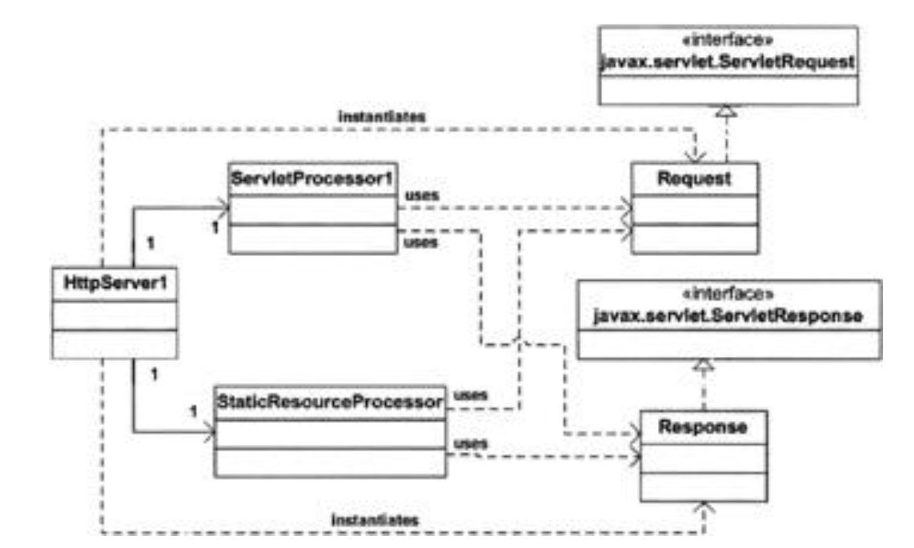

#### Overview

This chapter explains how you can develop your own servlet container by presenting two applications. The first application has been designed to be as simple as possible to make it easy for you to understand how a servlet container works. It then evolves into the second servlet container, which is slightly more complex.

Note Every servlet container application in each chapter gradually evolves from the application in the previous chapter, until a fully-functional Tomcat servlet container is built in Chapter 17.

Both servlet containers can process simple servlets as well as static resources. You can use PrimitiveServlet to test this container. PrimitiveServlet is given in Listing 2.1 and its class file can be found in the webroot directory. More complex servlets are beyond the capabilities of these containers, but you will learn how to build more sophisticated servlet containers in the next chapters.

Listing 2.1: PrimitiveServlet.java

```
import javax.servlet.*;
import java.io.IOException;
import java.io.PrintWriter;

public class PrimitiveServlet implements Servlet {
    public void init(ServletConfig config) throws ServletException {
        System.out.println("init");
    }
    public void service(ServletRequest request, ServletResponse response)
            throws ServletException, IOException {
        System.out.println("from service");
        PrintWriter out = response.getWriter();
        out.println("Hello. Roses are red.");
        out.print("Violets are blue.");
    }
    public void destroy() {
        System.out.println("destroy");
    }

    public String getServletInfo() {
        return null;
    }
    public ServletConfig getServletConfig() {
        return null;
    }
}
```

The classes for both applications are part of the ex02.pyrmont package. To understand how the applications work, you need to be familiar with the javax.servlet.Servlet interface. To refresh your memory, this interface is discussed in the first section of this chapter. After that, you will learn what a servlet container has to do to serve HTTP requests for a servlet.


#### The javax.servlet.Servlet Interface

Servlet programming is made possible through the classes and interfaces in two packages: javax.servlet and javax.servlet.http. Of those classes and interfaces, the `javax.servlet.Servlet` interface is of the utmost importance. All servlets must implement this interface or extend a class that does.

The Servlet interface has five methods whose signatures are as follows.

```
public void init(ServletConfig config) throws ServletException
public void service(ServletRequest request, ServletResponse response)
    throws ServletException, java.io.IOException
public void destroy()
public ServletConfig getServletConfig()
public java.lang.String getServletInfo()
```

Of the five methods in Servlet, the init, service, and destroy methods are the servlet's life cycle methods. The init method is called by the servlet container after the servlet class has been instantiated. The servlet container calls this method exactly once to indicate to the servlet that the servlet is being placed into service. The init method must complete successfully before the servlet can receive any requests. A servlet programmer can override this method to write initialization code that needs to run only once, such as loading a database driver, initializing values, and so on. In other cases, this method is normally left blank.

The servlet container calls the service method of a servlet whenever there is a request for the servlet. The servlet container passes a javax.servlet.ServletRequest object and a javax.servlet.ServletResponse object. The ServletRequest objectcontains the client's HTTP request information and the ServletResponse object encapsulates the servlet's response. The service method is invoked many times during the life of the servlet.

The servlet container calls the destroy method before removing a servlet instance from service. This normally happens when the servlet container is shut down or the servlet container needs some free memory. This method is called only after all threads within the servlet's service method have exited or after a timeout period has passed. After the servlet container has called the destroy method, it will not call the service method again on the same servlet. The destroy method gives the servlet an opportunity to clean up any resources that are being held, such as memory, file handles, and threads, and make sure that any persistent state is synchronized with the servlet's current state in memory.

Listing 2.1 presents the code for a servlet named PrimitiveServlet, which is a very simple servlet that you can use to test the servlet container applications in this chapter. The PrimitiveServlet class implements javax.servlet.Servlet (as all servlets must) and provides implementations for all the five methods of Servlet. What PrimitiveServlet does is very simple. Each time any of the init, service, or destroy methods is called, the servlet writes the method's name to the standard console. In addition, the service method obtains the java.io.PrintWriter object from the ServletResponse object and sends strings to the browser.

#### Application 1

Now, let's examine servlet programming from a servlet container's perspective. In a nutshell, a fully-functional servlet container does the following for each HTTP request for a servlet:

- When the servlet is called for the first time, load the servlet class and call the servlet's init method (once only)
- For each request, construct an instance of javax.servlet.ServletRequest and an instance of javax.servlet.ServletResponse.
- Invoke the servlet's service method, passing the ServletRequest and ServletResponse objects.
- When the servlet class is shut down, call the servlet's destroy method and unload the servlet class.

The first servlet container for this chapter is not fully functional. Therefore, it cannot run other than very simple servlets and does not call the servlets' init and destroy methods. Instead, it does the following:

- Wait for HTTP requests.
- Construct a ServletRequest object and a ServletResponse object.
- If the request is for a static resource, invoke the process method of the StaticResourceProcessor instance, passing the ServletRequest and ServletResponse objects.
- If the request is for a servlet, load the servlet class and invoke the service method of the servlet, passing the ServletRequest and ServletResponse objects.

Note In this servlet container, the servlet class is loaded every time the servlet is requested.

The first application consists of six classes:
- HttpServer1
- Request
- Response
- StaticResourceProcessor
- ServletProcessor1
- Constants

Figure 2.1 displays the UML diagram of the first servlet container.


Figure 2.1: The UML diagram of the first servlet container


The entry point of this application (the static main method) is in the HttpServer1 class. The main method creates an instance of HttpServer1 and calls its await method. The await method waits for HTTP requests, creates a Request object and a Response object for every request, and dispatch them either to a StaticResourceProcessor instance or a ServletProcessor instance, depending on whether the request is for a static resource or a servlet.

The Constants class contains the static final WEB_ROOT that is referenced from other classes. WEB_ROOT indicates the location of PrimitiveServlet and the static resource that can be served by this container.

The HttpServer1 instance keeps waiting for HTTP requests until a shutdown command is received. You issue a shutdown command the same way as you did it in Chapter 1.

Each of the classes in the application is discussed in the following sections.


#### The HttpServer1 Class

The HttpServer1 class in this application is similar to the HttpServer class in the simple web server application in Chapter 1. However, in this application the HttpServer1 class can serve both static resources and servlets. To request a static resource, you type a URL in the following format in your browser's Address or URL box:

http://machineName:port/staticResource

This is exactly how you requested a static resource in the web server application in Chapter 1.

To request a servlet, you use the following URL:

http://machineName:port/servlet/servletClass

Therefore, if you are using a browser locally to request a servlet called PrimitiveServlet, you enter the following URL in the browser's Address or URL box:

http://localhost:8080/servlet/PrimitiveServlet

This servlet container can serve PrimitiveServlet. However, if you invoke the other servlet, ModernServlet, the servlet container will throw an exception. At the later chapters, you will build applications that can process both.

The HttpServer1 class is presented in Listing 2.2.

Listing 2.2: The HttpServer1 Class's await method

```
package ex02.pyrmont;

import java.net.Socket; 
import java.net.ServerSocket; 
import java.net.InetAddress;
import java.io.InputStream; 
import java.io.OutputStream; 
import java.io.IOException;

public class HttpServer1 {
    /** WEB_ROOT is the directory where our HTML and other files reside.
    * For this package, WEB_ROOT is the "webroot" directory under the
    * working directory.
    * The working directory is the location in the file system
    * from where the java command was invoked.
    */
    // shutdown command
    private static final String SHUTDOWN_COMMAND = "/SHUTDOWN";
    // the shutdown command received private boolean shutdown = false;
    public static void main(String[] args) { 
        HttpServer1 server = new HttpServer1(); 
        server.await();
    }

    public void await() {
        ServerSocket serverSocket = null; int port = 8080;
        try {
            serverSocket = new ServerSocket(port, 1, InetAddress.getByName("127.0.0.1"));
        }
        catch (IOException e) { 
            e.printStackTrace(); 
            System.exit(1);
        }
        // Loop waiting for a request 
        while (!shutdown) {
            Socket socket = null; 
            InputStream input = null; 
            OutputStream output = null; 
            try {
                socket = serverSocket.accept(); 
                input = socket.getInputstream();
                output = socket.getOutputStream();

                // create Request object and parse 
                Request request = new Request(input); 
                request.parse();

                // create Response object
                Response response = new Response(output); 
                response.setRequest(request);

                // check if this is a request for a servlet or
                // a static resource
                // a request for a servlet begins with "/servlet/"
                if (request.getUri().startsWith("/servlet/")) {
                    ServletProcessor1 processor = new ServletProcessor1();
                    processor.process(request, response);
                }
                else {
                    StaticResoureProcessor processor = new StaticResourceProcessor();
                    processor.process(request, response);
                }

                // Close the socket
                socket.close();
                
                //check if the previous URI is a shutdown command
                shutdown = request.getUri().equals(SHUTDOWN_COMMAND);
            }
            catch (Exception e) {
                e.printStackTrace();
                System.exit(1); 
            }
        } 
    }
}
```

The class's await method waits for HTTP requests until a shutdown command is issued, and reminds you of the await method in Chapter 1. The difference between the await method in Listing 2.2 and the one in Chapter 1 is that in Listing 2.2 the request can be dispatched to either a StaticResourceProcessor or a ServletProcessor. The request is forwarded to the latter if the URI contains the string /servlet/.

Otherwise, the request is passed to the StaticResourceProcessor instance. Notice that that part is greyed in Listing 2.2.


#### The Request Class

A servlet's service method receives a javax.servlet.ServletRequest instance and a javax.servlet.ServletResponse instance from the servlet container. This is to say that for every HTTP request, a servlet container must construct a ServletRequest object and a ServletResponse object and pass them to the service method of the servlet it is serving.

The ex02.pyrmont.Request class represents a request object to be passed to the servlet's service method. As such, it must implement the javax.servlet.ServletRequest interface. This class has to provide implementations for all methods in the interface. However, we would like to make it very simple and provide the implementations of some of the methods only we leave the full method implementations for the chapters to come. In order to compile the Request class, you sneed to provide "blank" implementations for those methods. If you look at the Request class in Listing 2.3, you will see that all methods whose signatures return an object instance return a null.

Listing 2.3: The Request class

```
package ex02.pyrmont;
import java.io.InputStream;
import java.io.IOException;
import java.io.BufferedReader;
import java.io.UnsupportedEncodingException;
import java.util.Enumeration;
import java.util.Locale;
import java.util.Map;
import javax.servlet.RequestDispatcher;
import javax.servlet.ServletInputStream;
import javax.servlet.ServletRequest;


public class Request implements ServletRequest {
    private InputStream input;
    private String uri;

    public Request(InputStream input){
        this.input = input;
    }

    public String getUri() {
        return uri;
    }

    private String parseUri(String requestString) {
        int index1, index2;
        index1 = requestString.indexOf(' ');
        if (index1 != -1) {
            index2 = requestString.indexOf(' ', index1 + 1);
            if (index2 > index1)
                return requestString.substring(index1 + 1, index2);
        }
        return null;
    }

    public void parse() {
        // Read a set of characters from the socket
        StringBuffer request = new StringBuffer(2048);
        int i;
        byte[] buffer = new byte[2048];
        try {
        i = input.read(buffer);
        }
        catch (IOException e) {
        e.printStackTrace();
        i = -1;
        }
        for (int j=0; j<i; j++) {
            request.append((char) buffer(j));
        }
        System.out.print(request.toString());
        uri = parseUri(request.toString());
    }
    
    /* implementation of ServletRequest */
    public Object getAttribute(String attribute) {
        return null;
    }

    public Enumeration getAttributeNames() {
        return null;
    }

    public String getRealPath(String path) {
        return null;
    }

    public RequestDispatcher getRequestDispatcher(String path) {
        return null;
    }
    public boolean isSecure() {
        return false;
    }
    public String getCharacterEncoding() {
        return null;
    }
    public int getContentLength() {
        return 0;
    }
    public String getContentType() {
        return null;
    }
    public ServletInputStream getInputStream() throws IOException {
        return null;
    }
    public Locale getLocale() {
        return null;
    }
    public Enumeration getLocales() {
        return null;
    }
    public String getParameter(String name) {
        return null;
    }
    public Map getParameterMap() {
        return null;
    }
    public Enumeration getParameterNames() {
        return null;
    }
    public String[] getParameterValues(String parameter) {
        return null;
    }
    public String getProtocol() {
        return null;
    }
    public BufferedReader getReader() throws IOException {
        return null;
    }
    public String getRemoteAddr() {
        return null;
    }
    public String getRemoteHost() {
        return null;
    }
    public String getScheme() {
        return null;
    }
    public String getServerName() {
        return null;
    }
    public int getServerPort() {
        return 0;
    }
    public void removeAttribute(String attribute) { }
    public void setAttribute(String key, Object value) { }
    public void setCharacterEncoding(String encoding)
        throws UnsupportedEncodingException { }
}
```

In addition, the Request class still has the parse and the getUri methods which were discussed in Chapter 1.


#### The Response Class

The ex02.pyrmont.Response class, given in Listing 2.4, implements javax.servlet.ServletResponse. As such, the class must provide implementations for all the methods in the interface. Similar to the Request class, we leave the implementations of all methods "blank", except for the getWriter method.

Listing 2.4: The Response class

```
package ex02.pyrmont;

import java.io.OutputStream;
import java.io.IOException;
import java.io.FileInputStream;
import java.io.FileNotFoundException;
import java.io.File;
import java.io.PrintWriter;import java.util.Locale;
import javax.servlet.ServletResponse;
import javax.servlet.ServletOutputStream;


public class Response implements ServletResponse {
    private static final int BUFFER_SIZE = 1024;
    Request request;
    OutputStream output;
    PrintWriter writer;
    
    public Response(OutputStream output) {
        this.output = output;
    }

    public void setRequest(Request request) {
        this.request = request;
    }

    /* This method is used to serve static pages */
    public void sendStaticResource() throws IOException {
        byte[] bytes = new byte[BUFFER_SIZE];
        FileInputstream fis = null;
        try {
            /* request.getUri has been replaced by request.getRequestURI */
            File file = new File(Constants.WEB_ROOT, request.getUri());
            fis = new FileInputstream(file);
            /*
            HTTP Response = Status-Line
            *(( general-header | response-header | entity-header ) CRLF)
            CRLF
            [ message-body ]
            Status-Line = HTTP-Version SP Status-Code SP Reason-Phrase CRLF
            */
            int ch = fis.read(bytes, 0, BUFFER_SIZE);
            while (ch!=-1) {
                output.write(bytes, 0, ch);
                ch = fis.read(bytes, 0, BUFFER_SIZE);
            }
        }
        catch (FileNotFoundException e) {
            String errorMessage = "HTTP/1.1 404 File Not Found\r\n" +
            "Content-Type: text/html\r\n" +"Content-Length: 23\r\n" +
            "\r\n" +
            "<h1>File Not Found</h1>";
            output.write(errorMessage.getBytes());
        }
        finally {
            if (fis!=null)
            fis.close();
        }
    }
    
    /** implementation of ServletResponse */
    public void flushBuffer() throws IOException ( }
    public int getBufferSize() {
        return 0;
    }
    public String getCharacterEncoding() {
        return null;
    }
    public Locale getLocale() {
        return null;
    }
    public ServletOutputStream getOutputStream() throws IOException {
        return null;
    }
    public PrintWriter getWriter() throws IOException {
        // autoflush is true, println() will flush,
        // but print() will not.
        writer = new PrintWriter(output, true);
        return writer;
    }
    public boolean isCommitted() {
        return false;
    }
    public void reset() { }
    public void resetBuffer() { }
    public void setBufferSize(int size) { }
    public void setContentLength(int length) { }
    public void setContentType(String type) { }
    public void setLocale(Locale locale) { }
}
```

In the getWriter method, the second argument to the PrintWriter class's constructor is a boolean indicating whether or not autoflush is enabled. Passing true as the second argument will make any call to a println method flush the output. However, a print method does not flush the output.

Therefore, if a call to a print method happens to be the last line in a servlet's service method, the output will not be sent to the browser. This imperfection will be fixed in the later applications.

The Response class still has the sendStaticResource method discussed in Chapter 1.
